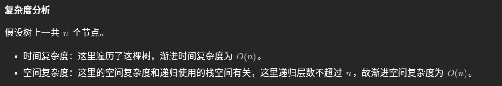
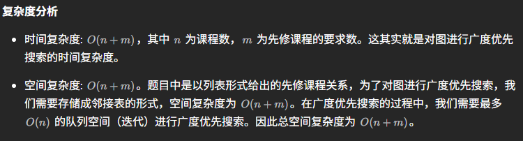
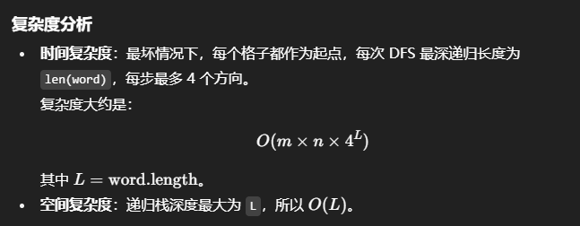

# 未分类

## 字母异位词

给你一个字符串数组，请你将 **字母异位词** 组合在一起。可以按任意顺序返回结果列表。

**字母异位词** 是由重新排列源单词的所有字母得到的一个新单词。

```
class Solution {
public:
    vector<vector<string>> groupAnagrams(vector<string>& strs) {
        std::unordered_map<std::string, std::vector<std::string>> map;

        for (const auto& str : strs) {
            // 创建一个临时字符串用于排序
            std::string key = str;
            std::sort(key.begin(), key.end()); // 对字符串排序
            map[key].push_back(str); // 将原字符串加入到对应的键中
        }

        std::vector<std::vector<std::string>> result;
        for (const auto& pair : map) {
            result.push_back(pair.second); // 将每个分组加入结果
        }

        return result;
    }
};
```

## 最长连续序列

给定一个未排序的整数数组 `nums` ，找出数字连续的最长序列（不要求序列元素在原数组中连续）的长度。

请你设计并实现时间复杂度为 `O(n)` 的算法解决此问题。

```
class Solution{
public:
    int longestConsecutive(vector<int>& nums){
        if(nums.size() < 2) return nums.size();
        sort(nums.begin(), nums.end());
        int lenmax = 0;
        int len = 1;
        for(int i=1; i<nums.size(); i++){
            if(nums[i] == nums[i-1]+1) len++;
            else if(nums[i] == nums[i-1]) continue;
            else{
                lenmax = (lenmax > len) ? lenmax:len;
                len=1;
            }
        }
        return max(len, lenmax);
    }
};
```

## 移动零

给定一个数组 `nums`，编写一个函数将所有 `0` 移动到数组的末尾，同时保持非零元素的相对顺序。

**请注意** ，必须在不复制数组的情况下原地对数组进行操作。

```
class Solution {
public:
    void moveZeroes(vector<int>& nums) {
        int n = nums.size(), left = 0, right = 0;
        while (right < n) {
            if (nums[right]) {
                swap(nums[left], nums[right]);
                left++;
            }
            right++;
        }
    }
};
```

另外

```
    void moveZeroes(vector<int>& nums) {
        int j=0;
        for(int i=0; i<nums.size(); i++){
            if(nums[i] != 0){
                nums[j] = nums[i];
                if(i != j){
                    nums[i] = 0;
                }
                j++;
            }
        }
    }
```

## [盛最多水的容器](https://leetcode.cn/problems/container-with-most-water/)

给定一个长度为 `n` 的整数数组 `height` 。有 `n` 条垂线，第 `i` 条线的两个端点是 `(i, 0)` 和 `(i, height[i])` 。

找出其中的两条线，使得它们与 `x` 轴共同构成的容器可以容纳最多的水。

返回容器可以储存的最大水量。

**说明：**你不能倾斜容器。

```
我自己写的
class Solution {
public:
    int maxArea(vector<int>& height) {
        int result = 0;
        int left = 0;
        int right = height.size()-1;
        int length = 0;

        while(left<right){
            if(height[left] >= height[right]){
                length = height[right];
            }
            else{
                length = height[left];
            }
            int temp = (right-left)*length;
            result = temp > result ? temp:result;

            if(height[left] >= height[right]){
                right--;
            }
            else{
                left++;
            }
        }
        return result;
    }
};
```

官方题解

```
class Solution {
public:
    int maxArea(vector<int>& height) {
        int l = 0, r = height.size() - 1;
        int ans = 0;
        while (l < r) {
            int area = min(height[l], height[r]) * (r - l);
            ans = max(ans, area);
            if (height[l] <= height[r]) {
                ++l;
            }
            else {
                --r;
            }
        }
        return ans;
    }
};
```

## [三数之和](https://leetcode.cn/problems/3sum/)

给你一个整数数组 `nums` ，判断是否存在三元组 `[nums[i], nums[j], nums[k]]` 满足 `i != j`、`i != k` 且 `j != k` ，同时还满足 `nums[i] + nums[j] + nums[k] == 0` 。请你返回所有和为 `0` 且不重复的三元组。

**注意：**答案中不可以包含重复的三元组。

```
class Solution {
public:
    vector<vector<int>> threeSum(vector<int>& nums) {
        vector<vector<int>> result;
        sort(nums.begin(), nums.end());
        // 找出a + b + c = 0
        // a = nums[i], b = nums[left], c = nums[right]
        for (int i = 0; i < nums.size(); i++) {
            // 排序之后如果第一个元素已经大于零，那么无论如何组合都不可能凑成三元组，直接返回结果就可以了
            if (nums[i] > 0) {
                return result;
            }
            // 错误去重a方法，将会漏掉-1,-1,2 这种情况
            /*
            if (nums[i] == nums[i + 1]) {
                continue;
            }
            */
            // 正确去重a方法
            if (i > 0 && nums[i] == nums[i - 1]) {
                continue;
            }
            int left = i + 1;
            int right = nums.size() - 1;
            while (right > left) {
                // 去重复逻辑如果放在这里，0，0，0 的情况，可能直接导致 right<=left 了，从而漏掉了 0,0,0 这种三元组
                /*
                while (right > left && nums[right] == nums[right - 1]) right--;
                while (right > left && nums[left] == nums[left + 1]) left++;
                */
                if (nums[i] + nums[left] + nums[right] > 0) right--;
                else if (nums[i] + nums[left] + nums[right] < 0) left++;
                else {
                    result.push_back(vector<int>{nums[i], nums[left], nums[right]});
                    // 去重逻辑应该放在找到一个三元组之后，对b 和 c去重
                    while (right > left && nums[right] == nums[right - 1]) right--;
                    while (right > left && nums[left] == nums[left + 1]) left++;

                    // 找到答案时，双指针同时收缩
                    right--;
                    left++;
                }
            }

        }
        return result;
    }
};
```

## 无重复字符的最长子串

给定一个字符串 `s` ，请你找出其中不含有重复字符的 **最长 子串** 的长度

**示例 1:**

```
输入: s = "abcabcbb"
输出: 3 
解释: 因为无重复字符的最长子串是 "abc"，所以其长度为 3。
```

**示例 2:**

```
输入: s = "bbbbb"
输出: 1
解释: 因为无重复字符的最长子串是 "b"，所以其长度为 1。
```

**示例 3:**

```c++
输入: s = "pwwkew"
输出: 3
解释: 因为无重复字符的最长子串是 "wke"，所以其长度为 3。
     请注意，你的答案必须是 子串 的长度，"pwke" 是一个子序列，不是子串。
```

滑动窗口

```
class Solution {
public:
    int lengthOfLongestSubstring(string s) {
        // 哈希集合，记录每个字符是否出现过
        unordered_set<char> occ;
        int n = s.size();
        // 右指针，初始值为 -1，相当于我们在字符串的左边界的左侧，还没有开始移动
        int rk = -1, ans = 0;
        // 枚举左指针的位置，初始值隐性地表示为 -1
        for (int i = 0; i < n; ++i) {
            if (i != 0) {
                // 左指针向右移动一格，移除一个字符
                occ.erase(s[i - 1]);
            }
            while (rk + 1 < n && !occ.count(s[rk + 1])) {
                // 不断地移动右指针
                occ.insert(s[rk + 1]);
                ++rk;
            }
            // 第 i 到 rk 个字符是一个极长的无重复字符子串
            ans = max(ans, rk - i + 1);
        }
        return ans;
    }
};
```

## 找出字符串中的所有字母异位词

给定两个字符串 `s` 和 `p`，找到 `s` 中所有 `p` 的 **异位词** 的子串，返回这些子串的起始索引。不考虑答案输出的顺序

**示例 1:**

```
输入: s = "cbaebabacd", p = "abc"
输出: [0,6]
解释:
起始索引等于 0 的子串是 "cba", 它是 "abc" 的异位词。
起始索引等于 6 的子串是 "bac", 它是 "abc" 的异位词。
```

 **示例 2:**

```
输入: s = "abab", p = "ab"
输出: [0,1,2]
解释:
起始索引等于 0 的子串是 "ab", 它是 "ab" 的异位词。
起始索引等于 1 的子串是 "ba", 它是 "ab" 的异位词。
起始索引等于 2 的子串是 "ab", 它是 "ab" 的异位词。
```

**提示:**

- `1 <= s.length, p.length <= 3 * 104`
- `s` 和 `p` 仅包含小写字母

```
class Solution {
public:
    vector<int> findAnagrams(string s, string p) {
        int sLen = s.size(), pLen = p.size();

        if (sLen < pLen) {
            return vector<int>();
        }

        vector<int> ans;
        vector<int> sCount(26);
        vector<int> pCount(26);
        // 初始滑动窗口
        for (int i = 0; i < pLen; ++i) {
            ++sCount[s[i] - 'a'];
            ++pCount[p[i] - 'a'];
        }

        if (sCount == pCount) {
            ans.emplace_back(0);
        }

        for (int i = 0; i < sLen - pLen; ++i) {
            --sCount[s[i] - 'a'];
            ++sCount[s[i + pLen] - 'a'];

            if (sCount == pCount) {
                ans.emplace_back(i + 1);
            }
        }

        return ans;
    }
};
```

## 和为K的子数组

给你一个整数数组 `nums` 和一个整数 `k` ，请你统计并返回 *该数组中和为 `k` 的子数组的个数* 。

子数组是数组中元素的连续非空序列。

**示例 1：**

```
输入：nums = [1,1,1], k = 2
输出：2
```

**示例 2：**

```
输入：nums = [1,2,3], k = 3
输出：2
```

 

**提示：**

- `1 <= nums.length <= 2 * 104`
- `-1000 <= nums[i] <= 1000`
- `-107 <= k <= 107`

### 枚举

```
class Solution {
public:
    int subarraySum(vector<int>& nums, int k) {
        int count = 0;
        for (int start = 0; start < nums.size(); ++start) {
            int sum = 0;
            for (int end = start; end >= 0; --end) {
                sum += nums[end];
                if (sum == k) {
                    count++;
                }
            }
        }
        return count;
    }
};
```


### 前缀和加哈希表

```
class Solution {
public:
    int subarraySum(vector<int>& nums, int k) {
        unordered_map<int, int> mp;
        mp[0] = 1;
        int count = 0, pre = 0;
        for (auto& x:nums) {
            pre += x;
            if (mp.find(pre - k) != mp.end()) {
                count += mp[pre - k];
            }
            mp[pre]++;
        }
        return count;
    }
};
```


## 滑动窗口最大值

给你一个整数数组 `nums`，有一个大小为 `k` 的滑动窗口从数组的最左侧移动到数组的最右侧。你只可以看到在滑动窗口内的 `k` 个数字。滑动窗口每次只向右移动一位。

返回 *滑动窗口中的最大值* 。

**示例 1：**

```
输入：nums = [1,3,-1,-3,5,3,6,7], k = 3
输出：[3,3,5,5,6,7]
解释：
滑动窗口的位置                最大值
---------------               -----
[1  3  -1] -3  5  3  6  7       3
 1 [3  -1  -3] 5  3  6  7       3
 1  3 [-1  -3  5] 3  6  7       5
 1  3  -1 [-3  5  3] 6  7       5
 1  3  -1  -3 [5  3  6] 7       6
 1  3  -1  -3  5 [3  6  7]      7
```

**示例 2：**

```
输入：nums = [1], k = 1
输出：[1]
```

**提示：**

- `1 <= nums.length <= 105`
- `-104 <= nums[i] <= 104`
- `1 <= k <= nums.length`

```
class Solution {
public:
    vector<int> maxSlidingWindow(vector<int>& nums, int k) {
        int n = nums.size();
        priority_queue<pair<int, int>> q;
        for (int i = 0; i < k; ++i) {
            q.emplace(nums[i], i);
        }
        vector<int> ans = {q.top().first};
        for (int i = k; i < n; ++i) {
            q.emplace(nums[i], i);
            while (q.top().second <= i - k) {
                q.pop();
            }
            ans.push_back(q.top().first);
        }
        return ans;
    }
};
```


## [最大子数组和](https://leetcode.cn/problems/maximum-subarray/)

给你一个整数数组 `nums` ，请你找出一个具有最大和的连续子数组（子数组最少包含一个元素），返回其最大和。

**子数组**是数组中的一个连续部分。

**示例 1：**

```
输入：nums = [-2,1,-3,4,-1,2,1,-5,4]
输出：6
解释：连续子数组 [4,-1,2,1] 的和最大，为 6 。
```

**示例 2：**

```
输入：nums = [1]
输出：1
```

**示例 3：**

```
输入：nums = [5,4,-1,7,8]
输出：23
```

 

**提示：**

- `1 <= nums.length <= 105`
- `-104 <= nums[i] <= 104`

```
class Solution {
public:
    int maxSubArray(vector<int>& nums) {
        int pre = 0, maxAns = nums[0];
        for (const auto &x: nums) {
            pre = max(pre + x, x);
            maxAns = max(maxAns, pre);
        }
        return maxAns;
    }
};
```


## 普通数组

### [合并区间](https://leetcode.cn/problems/merge-intervals/)

以数组 `intervals` 表示若干个区间的集合，其中单个区间为 `intervals[i] = [starti, endi]` 。请你合并所有重叠的区间，并返回 *一个不重叠的区间数组，该数组需恰好覆盖输入中的所有区间* 。

 

**示例 1：**

```
输入：intervals = [[1,3],[2,6],[8,10],[15,18]]
输出：[[1,6],[8,10],[15,18]]
解释：区间 [1,3] 和 [2,6] 重叠, 将它们合并为 [1,6].
```

**示例 2：**

```
输入：intervals = [[1,4],[4,5]]
输出：[[1,5]]
解释：区间 [1,4] 和 [4,5] 可被视为重叠区间。
```

 

**提示：**

- `1 <= intervals.length <= 104`
- `intervals[i].length == 2`
- `0 <= starti <= endi <= 104`

```
class Solution {
public:
    vector<vector<int>> merge(vector<vector<int>>& intervals) {
        if (intervals.size() == 0) {
            return {};
        }
        sort(intervals.begin(), intervals.end());
        vector<vector<int>> merged;
        for (int i = 0; i < intervals.size(); ++i) {
            int L = intervals[i][0], R = intervals[i][1];
            if (!merged.size() || merged.back()[1] < L) {
                merged.push_back({L, R});
            }
            else {
                merged.back()[1] = max(merged.back()[1], R);
            }
        }
        return merged;
    }
};
```


> 在 C++ 中，`std::sort` 默认是按照 **字典序（lexicographical order）** 对 `vector` 或数组进行排序的。对于 `vector<vector<int>>` 类型的 `intervals`，默认排序规则是：
>
> 1. **先比较第一个元素**（`intervals[i][0]`）。
> 2. 如果第一个元素相同，再比较第二个元素（`intervals[i][1]`），以此类推。

### [轮转数组](https://leetcode.cn/problems/rotate-array/)

给定一个整数数组 `nums`，将数组中的元素向右轮转 `k` 个位置，其中 `k` 是非负数

#### 额外数组

```
class Solution {
public:
    void rotate(vector<int>& nums, int k) {
        int n = nums.size();
        vector<int> newArr(n);
        for (int i = 0; i < n; ++i) {
            newArr[(i + k) % n] = nums[i];
        }
        nums.assign(newArr.begin(), newArr.end());
    }
};
```


#### 三次翻转

1. 反转整个数组。
2. 反转前 `k` 个元素。
3. 反转后 `n - k` 个元素。

```c++
#include <vector>
#include <algorithm>  // 使用 reverse
using namespace std;

void rotate(vector<int>& nums, int k) {
    int n = nums.size();
    k %= n;  // 处理 k 大于数组长度的情况
    reverse(nums.begin(), nums.end());          // 1. 反转整个数组
    reverse(nums.begin(), nums.begin() + k);    // 2. 反转前 k 个元素
    reverse(nums.begin() + k, nums.end());      // 3. 反转后 n - k 个元素
}


class Solution {
public:
    void reverse(vector<int>& nums, int start, int end) {
        while (start < end) {
            swap(nums[start], nums[end]);
            start += 1;
            end -= 1;
        }
    }

    void rotate(vector<int>& nums, int k) {
        k %= nums.size();
        reverse(nums, 0, nums.size() - 1);
        reverse(nums, 0, k - 1);
        reverse(nums, k, nums.size() - 1);
    }
};
```


### [除自身以外数组的乘积](https://leetcode.cn/problems/product-of-array-except-self/)

给你一个整数数组 `nums`，返回 数组 `answer` ，其中 `answer[i]` 等于 `nums` 中除 `nums[i]` 之外其余各元素的乘积 。

题目数据 **保证** 数组 `nums`之中任意元素的全部前缀元素和后缀的乘积都在 **32 位** 整数范围内。

请 **不要使用除法，**且在 `O(n)` 时间复杂度内完成此题

左右乘积列表

我们不必将所有数字的乘积除以给定索引处的数字得到相应的答案，而是利用索引左侧所有数字的乘积和右侧所有数字的乘积（即前缀与后缀）相乘得到答案。

```
class Solution {
public:
    vector<int> productExceptSelf(vector<int>& nums) {
        int length = nums.size();

        // L 和 R 分别表示左右两侧的乘积列表
        vector<int> L(length, 0), R(length, 0);

        vector<int> answer(length);

        // L[i] 为索引 i 左侧所有元素的乘积
        // 对于索引为 '0' 的元素，因为左侧没有元素，所以 L[0] = 1
        L[0] = 1;
        for (int i = 1; i < length; i++) {
            L[i] = nums[i - 1] * L[i - 1];
        }

        // R[i] 为索引 i 右侧所有元素的乘积
        // 对于索引为 'length-1' 的元素，因为右侧没有元素，所以 R[length-1] = 1
        R[length - 1] = 1;
        for (int i = length - 2; i >= 0; i--) {
            R[i] = nums[i + 1] * R[i + 1];
        }

        // 对于索引 i，除 nums[i] 之外其余各元素的乘积就是左侧所有元素的乘积乘以右侧所有元素的乘积
        for (int i = 0; i < length; i++) {
            answer[i] = L[i] * R[i];
        }

        return answer;
    }
};
```


# 矩阵

## [螺旋矩阵](https://leetcode.cn/problems/spiral-matrix/)

给你一个 `m` 行 `n` 列的矩阵 `matrix` ，请按照 **顺时针螺旋顺序** ，返回矩阵中的所有元素

```
#include <vector>
using namespace std;

class Solution {
public:
    vector<int> spiralOrder(vector<vector<int>>& matrix) {
        if (matrix.empty() || matrix[0].empty()) return {};
        
        int m = matrix.size(), n = matrix[0].size();
        vector<int> result;
        int top = 0, bottom = m - 1, left = 0, right = n - 1;
        
        while (top <= bottom && left <= right) {
            // 从左到右遍历 top 行
            for (int i = left; i <= right; ++i) {
                result.push_back(matrix[top][i]);
            }
            top++;
            
            // 从上到下遍历 right 列
            for (int i = top; i <= bottom; ++i) {
                result.push_back(matrix[i][right]);
            }
            right--;
            
            if (top <= bottom) {
                // 从右到左遍历 bottom 行
                for (int i = right; i >= left; --i) {
                    result.push_back(matrix[bottom][i]);
                }
                bottom--;
            }
            
            if (left <= right) {
                // 从下到上遍历 left 列
                for (int i = bottom; i >= top; --i) {
                    result.push_back(matrix[i][left]);
                }
                left++;
            }
        }
        
        return result;
    }
};
```

## [旋转图像](https://leetcode.cn/problems/rotate-image/)

给定一个 *n* × *n* 的二维矩阵 `matrix` 表示一个图像。请你将图像顺时针旋转 90 度。

你必须在**[ 原地](https://baike.baidu.com/item/原地算法)** 旋转图像，这意味着你需要直接修改输入的二维矩阵。**请不要** 使用另一个矩阵来旋转图像。

### 使用辅助数组

```
class Solution {
public:
    void rotate(vector<vector<int>>& matrix) {
        int n = matrix.size();
        // C++ 这里的 = 拷贝是值拷贝，会得到一个新的数组
        auto matrix_new = matrix;
        for (int i = 0; i < n; ++i) {
            for (int j = 0; j < n; ++j) {
                matrix_new[j][n - i - 1] = matrix[i][j];
            }
        }
        // 这里也是值拷贝
        matrix = matrix_new;
    }
};
```


### 原地旋转

```
class Solution {
public:
    void rotate(vector<vector<int>>& matrix) {
        int n = matrix.size();
        for (int i = 0; i < n / 2; ++i) {
            for (int j = 0; j < (n + 1) / 2; ++j) {
                int temp = matrix[i][j];
                matrix[i][j] = matrix[n - j - 1][i];
                matrix[n - j - 1][i] = matrix[n - i - 1][n - j - 1];
                matrix[n - i - 1][n - j - 1] = matrix[j][n - i - 1];
                matrix[j][n - i - 1] = temp;
            }
        }
    }
};
```


## [搜索二维矩阵 II](https://leetcode.cn/problems/search-a-2d-matrix-ii/)

编写一个高效的算法来搜索 `*m* x *n*` 矩阵 `matrix` 中的一个目标值 `target` 。该矩阵具有以下特性：

- 每行的元素从左到右升序排列。
- 每列的元素从上到下升序排列。

```

```


## [矩阵置零](https://leetcode.cn/problems/set-matrix-zeroes/)

给定一个 `*m* x *n*` 的矩阵，如果一个元素为 **0** ，则将其所在行和列的所有元素都设为 **0** 。请使用 **[原地](http://baike.baidu.com/item/原地算法)** 算法

### 使用标记数组

我们可以用两个标记数组分别记录每一行和每一列是否有零出现。

具体地，我们首先遍历该数组一次，如果某个元素为 0，那么就将该元素所在的行和列所对应标记数组的位置置为 true。最后我们再次遍历该数组，用标记数组更新原数组即可。

```
class Solution {
public:
    void setZeroes(vector<vector<int>>& matrix) {
        int m = matrix.size();
        int n = matrix[0].size();
        vector<int> row(m), col(n);
        for (int i = 0; i < m; i++) {
            for (int j = 0; j < n; j++) {
                if (!matrix[i][j]) {
                    row[i] = col[j] = true;
                }
            }
        }
        for (int i = 0; i < m; i++) {
            for (int j = 0; j < n; j++) {
                if (row[i] || col[j]) {
                    matrix[i][j] = 0;
                }
            }
        }
    }
};
```


### 使用两个标记变量

## [搜索二维矩阵 II](https://leetcode.cn/problems/search-a-2d-matrix-ii/)

编写一个高效的算法来搜索 `*m* x *n*` 矩阵 `matrix` 中的一个目标值 `target` 。该矩阵具有以下特性：

- 每行的元素从左到右升序排列。
- 每列的元素从上到下升序排列。

### 直接查找

```c++
class Solution{
public:
    bool searchMatrix(vector<vector<int>>& matrix, int target){
        for(const auto& row:matrix){
            for(int element:row){
                if(element == target){
                    return true;
                }
            }
        }
        return false;
    }
};
```


### 二分查找

思路与算法

由于矩阵 matrix 中每一行的元素都是升序排列的，因此我们可以对每一行都使用一次二分查找，判断 target 是否在该行中，从而判断 target 是否出现。

```c++
class Solution {
public:
    bool searchMatrix(vector<vector<int>>& matrix, int target) {
		for(const auto& row:matrix){
            auto it = lower_bound(row.begin(), row.end(), target);
            if(it != row.end() && *it == target){
                return true;
            }
        }
        return false;
    }
};
```


# 链表

## [ 相交链表](https://leetcode.cn/problems/intersection-of-two-linked-lists/)

给你两个单链表的头节点 `headA` 和 `headB` ，请你找出并返回两个单链表相交的起始节点。如果两个链表不存在相交节点，返回 `null` 。

图示两个链表在节点 `c1` 开始相交**：**

[](https://assets.leetcode-cn.com/aliyun-lc-upload/uploads/2018/12/14/160_statement.png)

题目数据 **保证** 整个链式结构中不存在环。

**注意**，函数返回结果后，链表必须 **保持其原始结构** 。

### 哈希集合

```
class Solution {
public:
    ListNode *getIntersectionNode(ListNode *headA, ListNode *headB) {
        unordered_set<ListNode *> visited;
        ListNode *temp = headA;
        while (temp != nullptr) {
            visited.insert(temp);
            temp = temp->next;
        }
        temp = headB;
        while (temp != nullptr) {
            if (visited.count(temp)) {
                return temp;
            }
            temp = temp->next;
        }
        return nullptr;
    }
};
```


### 双指针

```
class Solution {
public:
    ListNode *getIntersectionNode(ListNode *headA, ListNode *headB) {
        if (headA == nullptr || headB == nullptr) {
            return nullptr;
        }
        ListNode *pA = headA, *pB = headB;
        while (pA != pB) {
            pA = pA == nullptr ? headB : pA->next;
            pB = pB == nullptr ? headA : pB->next;
        }
        return pA;
    }
};
```


## [反转链表](https://leetcode.cn/problems/reverse-linked-list/)

给你单链表的头节点 `head` ，请你反转链表，并返回反转后的链表。

### 迭代

```
class Solution {
public:
    ListNode* reverseList(ListNode* head) {
        ListNode* prev = nullptr;
        ListNode* curr = head;
        while (curr) {
            ListNode* next = curr->next;
            curr->next = prev;
            prev = curr;
            curr = next;
        }
        return prev;
    }
};
```


### 递归

```
class Solution {
public:
    ListNode* reverseList(ListNode* head) {
        if (!head || !head->next) {
            return head;
        }
        ListNode* newHead = reverseList(head->next);
        head->next->next = head;
        head->next = nullptr;
        return newHead;
    }
};
```

## [回文链表](https://leetcode.cn/problems/palindrome-linked-list/)

给你一个单链表的头节点 `head` ，请你判断该链表是否为回文链表。如果是，返回 `true` ；否则，返回 `false` 。

> 一共为两个步骤：
>
> 1. 复制链表值到数组列表中。
> 2. 使用双指针法判断是否为回文。

```
class Solution {
public:
    bool isPalindrome(ListNode* head) {
        vector<int> vals;
        while (head != nullptr) {
            vals.emplace_back(head->val);
            head = head->next;
        }
        for (int i = 0, j = (int)vals.size() - 1; i < j; ++i, --j) {
            if (vals[i] != vals[j]) {
                return false;
            }
        }
        return true;
    }
};
```


## [环形链表](https://leetcode.cn/problems/linked-list-cycle/)

给你一个链表的头节点 `head` ，判断链表中是否有环。

如果链表中有某个节点，可以通过连续跟踪 `next` 指针再次到达，则链表中存在环。 为了表示给定链表中的环，评测系统内部使用整数 `pos` 来表示链表尾连接到链表中的位置（索引从 0 开始）。**注意：`pos` 不作为参数进行传递** 。仅仅是为了标识链表的实际情况。

*如果链表中存在环* ，则返回 `true` 。 否则，返回 `false` 。

### 方法一：哈希表

```
class Solution {
public:
    bool hasCycle(ListNode *head) {
        unordered_set<ListNode*> seen;
        while (head != nullptr) {
            if (seen.count(head)) {
                return true;
            }
            seen.insert(head);
            head = head->next;
        }
        return false;
    }
};
```


### 方法二：快慢指针

```
class Solution {
public:
    bool hasCycle(ListNode* head) {
        if (head == nullptr || head->next == nullptr) {
            return false;
        }
        ListNode* slow = head;
        ListNode* fast = head->next;
        while (slow != fast) {
            if (fast == nullptr || fast->next == nullptr) {
                return false;
            }
            slow = slow->next;
            fast = fast->next->next;
        }
        return true;
    }
};
```


## [环形链表 II](https://leetcode.cn/problems/linked-list-cycle-ii/)

给定一个链表的头节点  `head` ，返回链表开始入环的第一个节点。 *如果链表无环，则返回 `null`。*

如果链表中有某个节点，可以通过连续跟踪 `next` 指针再次到达，则链表中存在环。 为了表示给定链表中的环，评测系统内部使用整数 `pos` 来表示链表尾连接到链表中的位置（**索引从 0 开始**）。如果 `pos` 是 `-1`，则在该链表中没有环。**注意：`pos` 不作为参数进行传递**，仅仅是为了标识链表的实际情况。

**不允许修改** 链表。

### 哈希表

```c++
class Solution {
public:
    ListNode *detectCycle(ListNode *head) {
        unordered_set<ListNode *> visited;
        while (head != nullptr) {
            if (visited.count(head)) {
                return head;
            }
            visited.insert(head);
            head = head->next;
        }
        return nullptr;
    }
};
```


### 快慢指针

```c++
class Solution {
public:
    ListNode *detectCycle(ListNode *head) {
        ListNode *slow = head, *fast = head;
        while (fast != nullptr) {
            slow = slow->next;
            if (fast->next == nullptr) {
                return nullptr;
            }
            fast = fast->next->next;
            if (fast == slow) {
                ListNode *ptr = head;
                while (ptr != slow) {
                    ptr = ptr->next;
                    slow = slow->next;
                }
                return ptr;
            }
        }
        return nullptr;
    }
};
```


## [合并两个有序链表](https://leetcode.cn/problems/merge-two-sorted-lists/)

将两个升序链表合并为一个新的 **升序** 链表并返回。新链表是通过拼接给定的两个链表的所有节点组成的

### 递归

```
class Solution {
public:
    ListNode* mergeTwoLists(ListNode* l1, ListNode* l2) {
        if (l1 == nullptr) {
            return l2;
        } else if (l2 == nullptr) {
            return l1;
        } else if (l1->val < l2->val) {
            l1->next = mergeTwoLists(l1->next, l2);
            return l1;
        } else {
            l2->next = mergeTwoLists(l1, l2->next);
            return l2;
        }
    }
};
```


## [删除链表的倒数第 N 个结点](https://leetcode.cn/problems/remove-nth-node-from-end-of-list/)

给你一个链表，删除链表的倒数第 `n` 个结点，并且返回链表的头结点

### 计算链表长度

```c++
class Solution{
public:
    int getLength(ListNode* head){
        int length = 0;
        while(head){
            ++length;
            head = head->next;
        }
        return length;
    }
    
    ListNode* removeNthFromEnd(ListNode* head, int n){
        ListNode* dummy = new ListNode(0, head);
        int length = getLength(head);
        for(int i=1; i<length-n+1; ++i){
            cur = cur->next;
        }
        cur->next = cur->next->next;
        ListNode* ans = dummy->next;
        delete dummy;
        return ans;
    }
};
```


### 双指针

```c++
class Solution{
public:
    ListNode* removeNthFromEnd(ListNode* head, int n){
        ListNode* dummy = new ListNode(0, head);
        ListNode* first = head;
        ListNode* second = dummy;
        for(int i=0; i<n; i++){
            first = first->next;
        }
        while(first){
            first = first->next;
            second = second->next;
        }
        second->next = second->next->next;
        ListNode* ans = dummy->next;
        delete dummy;
        return ans;
    }
}
```


### [排序链表](https://leetcode.cn/problems/sort-list/)

给你链表的头结点 `head` ，请将其按 **升序** 排列并返回 **排序后的链表** 

```c++
/**
 * Definition for singly-linked list.
 * struct ListNode {
 *     int val;
 *     ListNode *next;
 *     ListNode() : val(0), next(nullptr) {}
 *     ListNode(int x) : val(x), next(nullptr) {}
 *     ListNode(int x, ListNode *next) : val(x), next(next) {}
 * };
 */
class Solution {
public:
    ListNode* sortList(ListNode* head) {
        if (!head || !head->next) {
            return head;
        }
        
        // 使用快慢指针找到链表中点
        ListNode* slow = head;
        ListNode* fast = head->next;
        while (fast && fast->next) {
            slow = slow->next;
            fast = fast->next->next;
        }
        
        // 分割链表
        ListNode* mid = slow->next;
        slow->next = nullptr;
        
        // 递归排序两部分
        ListNode* left = sortList(head);
        ListNode* right = sortList(mid);
        
        // 合并两个有序链表
        return merge(left, right);
    }
    
private:
    ListNode* merge(ListNode* l1, ListNode* l2) {
        ListNode dummy(0);
        ListNode* tail = &dummy;
        
        while (l1 && l2) {
            if (l1->val < l2->val) {
                tail->next = l1;
                l1 = l1->next;
            } else {
                tail->next = l2;
                l2 = l2->next;
            }
            tail = tail->next;
        }
        
        tail->next = l1 ? l1 : l2;
        return dummy.next;
    }
};
```


## [LRU 缓存](https://leetcode.cn/problems/lru-cache/)

请你设计并实现一个满足 [LRU (最近最少使用) 缓存](https://baike.baidu.com/item/LRU) 约束的数据结构。

实现 `LRUCache` 类：

- `LRUCache(int capacity)` 以 **正整数** 作为容量 `capacity` 初始化 LRU 缓存
- `int get(int key)` 如果关键字 `key` 存在于缓存中，则返回关键字的值，否则返回 `-1` 。
- `void put(int key, int value)` 如果关键字 `key` 已经存在，则变更其数据值 `value` ；如果不存在，则向缓存中插入该组 `key-value` 。如果插入操作导致关键字数量超过 `capacity` ，则应该 **逐出** 最久未使用的关键字。

函数 `get` 和 `put` 必须以 `O(1)` 的平均时间复杂度运行。

```c++
struct DLinkedNode {
    int key, value;
    DLinkedNode* prev;
    DLinkedNode* next;
    DLinkedNode(): key(0), value(0), prev(nullptr), next(nullptr) {}
    DLinkedNode(int _key, int _value): key(_key), value(_value), prev(nullptr), next(nullptr) {}
};

class LRUCache {
private:
    unordered_map<int, DLinkedNode*> cache;
    DLinkedNode* head;
    DLinkedNode* tail;
    int size;
    int capacity;

public:
    LRUCache(int _capacity): capacity(_capacity), size(0) {
        // 使用伪头部和伪尾部节点
        head = new DLinkedNode();
        tail = new DLinkedNode();
        head->next = tail;
        tail->prev = head;
    }
    
    int get(int key) {
        if (!cache.count(key)) {
            return -1;
        }
        // 如果 key 存在，先通过哈希表定位，再移到头部
        DLinkedNode* node = cache[key];
        moveToHead(node);
        return node->value;
    }
    
    void put(int key, int value) {
        if (!cache.count(key)) {
            // 如果 key 不存在，创建一个新的节点
            DLinkedNode* node = new DLinkedNode(key, value);
            // 添加进哈希表
            cache[key] = node;
            // 添加至双向链表的头部
            addToHead(node);
            ++size;
            if (size > capacity) {
                // 如果超出容量，删除双向链表的尾部节点
                DLinkedNode* removed = removeTail();
                // 删除哈希表中对应的项
                cache.erase(removed->key);
                // 防止内存泄漏
                delete removed;
                --size;
            }
        }
        else {
            // 如果 key 存在，先通过哈希表定位，再修改 value，并移到头部
            DLinkedNode* node = cache[key];
            node->value = value;
            moveToHead(node);
        }
    }

    void addToHead(DLinkedNode* node) {
        node->prev = head;
        node->next = head->next;
        head->next->prev = node;
        head->next = node;
    }
    
    void removeNode(DLinkedNode* node) {
        node->prev->next = node->next;
        node->next->prev = node->prev;
    }

    void moveToHead(DLinkedNode* node) {
        removeNode(node);
        addToHead(node);
    }

    DLinkedNode* removeTail() {
        DLinkedNode* node = tail->prev;
        removeNode(node);
        return node;
    }
};
```


## [两数相加](https://leetcode.cn/problems/add-two-numbers/)

给你两个 **非空** 的链表，表示两个非负的整数。它们每位数字都是按照 **逆序** 的方式存储的，并且每个节点只能存储 **一位** 数字。

请你将两个数相加，并以相同形式返回一个表示和的链表。

你可以假设除了数字 0 之外，这两个数都不会以 0 开头。

```c++
/**
 * Definition for singly-linked list.
 * struct ListNode {
 *     int val;
 *     ListNode *next;
 *     ListNode() : val(0), next(nullptr) {}
 *     ListNode(int x) : val(x), next(nullptr) {}
 *     ListNode(int x, ListNode *next) : val(x), next(next) {}
 * };
 */
class Solution {
public:
    ListNode* addTwoNumbers(ListNode* l1, ListNode* l2) {
        ListNode* dummy = new ListNode(0); // 虚拟头节点
        ListNode* current = dummy;
        int carry = 0; // 进位

        while (l1 != nullptr || l2 != nullptr) {
            int x = (l1 != nullptr) ? l1->val : 0;
            int y = (l2 != nullptr) ? l2->val : 0;
            int sum = x + y + carry;
            carry = sum / 10;
            current->next = new ListNode(sum % 10);
            current = current->next;

            if (l1 != nullptr) l1 = l1->next;
            if (l2 != nullptr) l2 = l2->next;
        }

        if (carry > 0) {
            current->next = new ListNode(carry);
        }

        return dummy->next;
    }
};
```

## [两两交换链表中的节点](https://leetcode.cn/problems/swap-nodes-in-pairs/)

给你一个链表，两两交换其中相邻的节点，并返回交换后链表的头节点。你必须在不修改节点内部的值的情况下完成本题（即，只能进行节点交换）。

### 遇事不决

```c++
class Solution {
    public ListNode swapPairs(ListNode head) {
        ListNode dummy = new ListNode(0, head);
        ListNode cur = dummy;
        while (cur.next != null && cur.next.next != null) {
            ListNode end = cur.next.next;
            cur.next.next = end.next;
            end.next = cur.next;
            cur.next = end;
            cur = cur.next.next;
        }
        return dummy.next;
    }
}
```

### 递归

```c++
class Solution {
public:
    ListNode* swapPairs(ListNode* head) {
        if (head == nullptr || head->next == nullptr) {
            return head;
        }
        ListNode* newHead = head->next;
        head->next = swapPairs(newHead->next);
        newHead->next = head;
        return newHead;
    }
};
```


### 迭代

```c++
class Solution {
public:
    ListNode* swapPairs(ListNode* head) {
        ListNode* dummyHead = new ListNode(0);
        dummyHead->next = head;
        ListNode* temp = dummyHead;
        while (temp->next != nullptr && temp->next->next != nullptr) {
            ListNode* node1 = temp->next;
            ListNode* node2 = temp->next->next;
            temp->next = node2;
            node1->next = node2->next;
            node2->next = node1;
            temp = node1;
        }
        ListNode* ans = dummyHead->next;
        delete dummyHead;
        return ans;
    }
};
```


# 二叉树

## [二叉树的中序遍历](https://leetcode.cn/problems/binary-tree-inorder-traversal/)

给定一个二叉树的根节点 `root` ，返回 *它的 **中序** 遍历* 。

### 递归

```
class Solution {
public:
    void inorder(TreeNode* root, vector<int>& res) {
        if (!root) {
            return;
        }
        inorder(root->left, res);
        res.push_back(root->val);
        inorder(root->right, res);
    }
    vector<int> inorderTraversal(TreeNode* root) {
        vector<int> res;
        inorder(root, res);
        return res;
    }
};
```


## [二叉树的最大深度](https://leetcode.cn/problems/maximum-depth-of-binary-tree/)

给定一个二叉树 `root` ，返回其最大深度。

二叉树的 **最大深度** 是指从根节点到最远叶子节点的最长路径上的节点数。

### 深度优先搜索

```
class Solution {
public:
    int maxDepth(TreeNode* root) {
        if (root == nullptr) return 0;
        return max(maxDepth(root->left), maxDepth(root->right)) + 1;
    }
};
```


## [翻转二叉树](https://leetcode.cn/problems/invert-binary-tree/)

给你一棵二叉树的根节点 `root` ，翻转这棵二叉树，并返回其根节点。

### 递归

```
class Solution {
public:
    TreeNode* invertTree(TreeNode* root) {
        if (root == nullptr) {
            return nullptr;
        }
        TreeNode* left = invertTree(root->left);
        TreeNode* right = invertTree(root->right);
        root->left = right;
        root->right = left;
        return root;
    }
};
```


## [对称二叉树](https://leetcode.cn/problems/symmetric-tree/)

给你一个二叉树的根节点 `root` ， 检查它是否轴对称。

### 递归

```
class Solution {
public:
    bool check(TreeNode *p, TreeNode *q) {
        if (!p && !q) return true;
        if (!p || !q) return false;
        return p->val == q->val && check(p->left, q->right) && check(p->right, q->left);
    }

    bool isSymmetric(TreeNode* root) {
        return check(root->left, root->right);
    }
};
```



### 迭代

```
class Solution {
public:
    bool check(TreeNode *u, TreeNode *v) {
        queue <TreeNode*> q;
        q.push(u); q.push(v);
        while (!q.empty()) {
            u = q.front(); q.pop();
            v = q.front(); q.pop();
            if (!u && !v) continue;
            if ((!u || !v) || (u->val != v->val)) return false;

            q.push(u->left); 
            q.push(v->right);

            q.push(u->right); 
            q.push(v->left);
        }
        return true;
    }

    bool isSymmetric(TreeNode* root) {
        return check(root, root);
    }
};
```


## [二叉树的直径](https://leetcode.cn/problems/diameter-of-binary-tree/)

给你一棵二叉树的根节点，返回该树的 **直径** 。

二叉树的 **直径** 是指树中任意两个节点之间最长路径的 **长度** 。这条路径可能经过也可能不经过根节点 `root` 。

两节点之间路径的 **长度** 由它们之间边数表示。

### 深度优先搜索

```
class Solution {
    int ans;
    int depth(TreeNode* rt){
        if (rt == NULL) {
            return 0; // 访问到空节点了，返回0
        }
        int L = depth(rt->left); // 左儿子为根的子树的深度
        int R = depth(rt->right); // 右儿子为根的子树的深度
        ans = max(ans, L + R + 1); // 计算d_node即L+R+1 并更新ans
        return max(L, R) + 1; // 返回该节点为根的子树的深度
    }
public:
    int diameterOfBinaryTree(TreeNode* root) {
        ans = 1;
        depth(root);
        return ans - 1;
    }
};
```


## [将有序数组转换为二叉搜索树](https://leetcode.cn/problems/convert-sorted-array-to-binary-search-tree/)

给你一个整数数组 `nums` ，其中元素已经按 **升序** 排列，请你将其转换为一棵 平衡 二叉搜索树。

### 方法一：中序遍历，总是选择中间位置左边的数字作为根节点

```
class Solution {
public:
    TreeNode* sortedArrayToBST(vector<int>& nums) {
        return helper(nums, 0, nums.size() - 1);
    }

    TreeNode* helper(vector<int>& nums, int left, int right) {
        if (left > right) {
            return nullptr;
        }

        // 总是选择中间位置左边的数字作为根节点
        int mid = (left + right) / 2;

        TreeNode* root = new TreeNode(nums[mid]);
        root->left = helper(nums, left, mid - 1);
        root->right = helper(nums, mid + 1, right);
        return root;
    }
};
```

## [二叉树的层序遍历](https://leetcode.cn/problems/binary-tree-level-order-traversal/)

给你二叉树的根节点 `root` ，返回其节点值的 **层序遍历** 。 （即逐层地，从左到右访问所有节点）。

```c++
/**
 * Definition for a binary tree node.
 * struct TreeNode {
 *     int val;
 *     TreeNode *left;
 *     TreeNode *right;
 *     TreeNode() : val(0), left(nullptr), right(nullptr) {}
 *     TreeNode(int x) : val(x), left(nullptr), right(nullptr) {}
 *     TreeNode(int x, TreeNode *left, TreeNode *right) : val(x), left(left), right(right) {}
 * };
 */
#include <vector>
#include <queue>

class Solution {
public:
    std::vector<std::vector<int>> levelOrder(TreeNode* root) {
        std::vector<std::vector<int>> result;
        if (!root) return result;
        
        std::queue<TreeNode*> q;
        q.push(root);
        
        while (!q.empty()) {
            int levelSize = q.size();
            std::vector<int> currentLevel;
            
            for (int i = 0; i < levelSize; ++i) {
                TreeNode* node = q.front();
                q.pop();
                currentLevel.push_back(node->val);
                
                if (node->left) q.push(node->left);
                if (node->right) q.push(node->right);
            }
            
            result.push_back(currentLevel);
        }
        
        return result;
    }
};
```


## [验证二叉搜索树](https://leetcode.cn/problems/validate-binary-search-tree/)

给你一个二叉树的根节点 `root` ，判断其是否是一个有效的二叉搜索树。

**有效** 二叉搜索树定义如下：

- 节点的左子树只包含 **严格小于** 当前节点的数。
- 节点的右子树只包含 **严格大于** 当前节点的数。
- 所有左子树和右子树自身必须也是二叉搜索树。

```c++
/**
 * Definition for a binary tree node.
 * struct TreeNode {
 *     int val;
 *     TreeNode *left;
 *     TreeNode *right;
 *     TreeNode() : val(0), left(nullptr), right(nullptr) {}
 *     TreeNode(int x) : val(x), left(nullptr), right(nullptr) {}
 *     TreeNode(int x, TreeNode *left, TreeNode *right) : val(x), left(left), right(right) {}
 * };
 */
class Solution {
public:
    bool isValidBST(TreeNode* root){
        stack<TreeNode*> stack;
        long long inorder = (long long)INT_MIN -1;

        while(!stack.empty() || root != nullptr){
            while(root != nullptr){
                stack.push(root);
                root = root->left;
            }
            root = stack.top();
            stack.pop();

            if(root->val <= inorder){
                return false;
            }
            inorder = root->val;
            root = root->right;
        }
        return true;
    }
};

// class Solution {
// public:
//     bool isValidBST(TreeNode* root) {
//         TreeNode* prev = nullptr;
//         return inorder(root, prev);
//     }
    
// private:
//     bool inorder(TreeNode* node, TreeNode*& prev) {
//         if (!node) return true;
        
//         if (!inorder(node->left, prev)) {
//             return false;
//         }
        
//         if (prev && node->val <= prev->val) {
//             return false;
//         }
//         prev = node;
        
//         return inorder(node->right, prev);
//     }
// };
```


## [二叉搜索树中第 K 小的元素](https://leetcode.cn/problems/kth-smallest-element-in-a-bst/)

给定一个二叉搜索树的根节点 `root` ，和一个整数 `k` ，请你设计一个算法查找其中第 `k` 小的元素（从 1 开始计数）。

```c++
/**
 * Definition for a binary tree node.
 * struct TreeNode {
 *     int val;
 *     TreeNode *left;
 *     TreeNode *right;
 *     TreeNode() : val(0), left(nullptr), right(nullptr) {}
 *     TreeNode(int x) : val(x), left(nullptr), right(nullptr) {}
 *     TreeNode(int x, TreeNode *left, TreeNode *right) : val(x), left(left), right(right) {}
 * };
 */
class Solution {
public:
    int kthSmallest(TreeNode* root, int k) {
        std::stack<TreeNode*> stack;
        TreeNode* curr = root;
        int count = 0;
        
        while (curr != nullptr || !stack.empty()) {
            while (curr != nullptr) {
                stack.push(curr);
                curr = curr->left;
            }
            curr = stack.top();
            stack.pop();
            count++;
            if (count == k) {
                return curr->val;
            }
            curr = curr->right;
        }
        
        return -1; // 如果k超出范围，返回-1（题目保证k有效）
    }
};
```

## [二叉树的右视图](https://leetcode.cn/problems/binary-tree-right-side-view/)

给定一个二叉树的 **根节点** `root`，想象自己站在它的右侧，按照从顶部到底部的顺序，返回从右侧所能看到的节点值。

DFS

```c++
class Solution {
    public List<Integer> rightSideView(TreeNode root) {
        List<Integer> ans = new LinkedList<>();
        dfs(root, 1, ans);
        return ans;
    }
    
    public void dfs(TreeNode node, int i, List<Integer> ans) {
        if (node == null) {
            return;
        }
        if (i > ans.size()) {
            ans.add(node.val);
        }
        dfs(node.right, ++i, ans);
        dfs(node.left, i, ans);
    }
}
```

BFS

```c++
class Solution {
    public List<Integer> rightSideView(TreeNode root) {
        List<Integer> ans = new LinkedList<>();
        if (root == null) {
            return ans;
        }
        Deque<TreeNode> queue = new ArrayDeque<>();
        queue.offer(root);
        while (!queue.isEmpty()) {
            int size = queue.size();
            int temp = size;
            while (size > 0) {
                TreeNode poll = queue.poll();
                if (size == temp) {
                    ans.add(poll.val);
                }
                if (poll.right != null) {
                    queue.offer(poll.right);
                }
                if (poll.left != null) {
                    queue.offer(poll.left);
                }
                size--;
            }
        }
        return ans;
    }
}
```

## [二叉树展开为链表](https://leetcode.cn/problems/flatten-binary-tree-to-linked-list/)

给你二叉树的根结点 `root` ，请你将它展开为一个单链表：

- 展开后的单链表应该同样使用 `TreeNode` ，其中 `right` 子指针指向链表中下一个结点，而左子指针始终为 `null` 。
- 展开后的单链表应该与二叉树 [**先序遍历**](https://baike.baidu.com/item/先序遍历/6442839?fr=aladdin) 顺序相同。

```c++
class Solution {
public:
    void flatten(TreeNode* root) {
        vector<TreeNode*> l;
        preorderTraversal(root, l);
        int n = l.size();
        for (int i = 1; i < n; i++) {
            TreeNode *prev = l.at(i - 1), *curr = l.at(i);
            prev->left = nullptr;
            prev->right = curr;
        }
    }

    void preorderTraversal(TreeNode* root, vector<TreeNode*> &l) {
        if (root != NULL) {
            l.push_back(root);
            preorderTraversal(root->left, l);
            preorderTraversal(root->right, l);
        }
    }
};
```


## [从前序与中序遍历序列构造二叉树](https://leetcode.cn/problems/construct-binary-tree-from-preorder-and-inorder-traversal/)

给定两个整数数组 `preorder` 和 `inorder` ，其中 `preorder` 是二叉树的**先序遍历**， `inorder` 是同一棵树的**中序遍历**，请构造二叉树并返回其根节点

```c++
class Solution {
private:
    unordered_map<int, int> index;

public:
    TreeNode* myBuildTree(const vector<int>& preorder, const vector<int>& inorder, int preorder_left, int preorder_right, int inorder_left, int inorder_right) {
        if (preorder_left > preorder_right) {
            return nullptr;
        }
        
        // 前序遍历中的第一个节点就是根节点
        int preorder_root = preorder_left;
        // 在中序遍历中定位根节点
        int inorder_root = index[preorder[preorder_root]];
        
        // 先把根节点建立出来
        TreeNode* root = new TreeNode(preorder[preorder_root]);
        // 得到左子树中的节点数目
        int size_left_subtree = inorder_root - inorder_left;
        // 递归地构造左子树，并连接到根节点
        // 先序遍历中「从 左边界+1 开始的 size_left_subtree」个元素就对应了中序遍历中「从 左边界 开始到 根节点定位-1」的元素
        root->left = myBuildTree(preorder, inorder, preorder_left + 1, preorder_left + size_left_subtree, inorder_left, inorder_root - 1);
        // 递归地构造右子树，并连接到根节点
        // 先序遍历中「从 左边界+1+左子树节点数目 开始到 右边界」的元素就对应了中序遍历中「从 根节点定位+1 到 右边界」的元素
        root->right = myBuildTree(preorder, inorder, preorder_left + size_left_subtree + 1, preorder_right, inorder_root + 1, inorder_right);
        return root;
    }

    TreeNode* buildTree(vector<int>& preorder, vector<int>& inorder) {
        int n = preorder.size();
        // 构造哈希映射，帮助我们快速定位根节点
        for (int i = 0; i < n; ++i) {
            index[inorder[i]] = i;
        }
        return myBuildTree(preorder, inorder, 0, n - 1, 0, n - 1);
    }
};
```


## [路径总和 III](https://leetcode.cn/problems/path-sum-iii/)

给定一个二叉树的根节点 `root` ，和一个整数 `targetSum` ，求该二叉树里节点值之和等于 `targetSum` 的 **路径** 的数目。

**路径** 不需要从根节点开始，也不需要在叶子节点结束，但是路径方向必须是向下的（只能从父节点到子节点）。

```c++
class Solution {
public:
    int rootSum(TreeNode* root, int targetSum) {
        if (!root) {
            return 0;
        }

        int ret = 0;
        if (root->val == targetSum) {
            ret++;
        } 

        ret += rootSum(root->left, targetSum - root->val);
        ret += rootSum(root->right, targetSum - root->val);
        return ret;
    }

    int pathSum(TreeNode* root, int targetSum) {
        if (!root) {
            return 0;
        }
        
        int ret = rootSum(root, targetSum);
        ret += pathSum(root->left, targetSum);
        ret += pathSum(root->right, targetSum);
        return ret;
    }
};
```


### 前缀和

### 方法思路

要统计二叉树中和为 `targetSum`的路径数目，路径可以从任意节点开始，但必须向下延伸。我们可以使用**前缀和**的方法来高效地解决这个问题。

1. 1.

   **前缀和**：记录从根节点到当前节点的路径和。利用哈希表存储前缀和的出现次数，以便快速查找是否存在 `当前前缀和 - targetSum`的差值。

2. 2.

   **递归遍历**：深度优先搜索（DFS）遍历二叉树，维护当前路径的前缀和，并在哈希表中更新和查询。

3. 3.

   **回溯**：在递归返回时，需要恢复哈希表的状态，避免影响其他路径的统计

```c++
/**
 * Definition for a binary tree node.
 * struct TreeNode {
 *     int val;
 *     TreeNode *left;
 *     TreeNode *right;
 *     TreeNode() : val(0), left(nullptr), right(nullptr) {}
 *     TreeNode(int x) : val(x), left(nullptr), right(nullptr) {}
 *     TreeNode(int x, TreeNode *left, TreeNode *right) : val(x), left(left), right(right) {}
 * };
 */
#include <unordered_map>

class Solution {
public:
    int pathSum(TreeNode* root, int targetSum) {
        std::unordered_map<long, int> prefixSumCount;
        prefixSumCount[0] = 1; // 初始前缀和为0出现1次
        return dfs(root, 0, targetSum, prefixSumCount);
    }

private:
    int dfs(TreeNode* node, long currentSum, int targetSum, std::unordered_map<long, int>& prefixSumCount) {
        if (!node) return 0;

        currentSum += node->val;
        int res = prefixSumCount[currentSum - targetSum]; // 查找满足条件的路径数目

        prefixSumCount[currentSum]++; // 更新当前前缀和的出现次数
        res += dfs(node->left, currentSum, targetSum, prefixSumCount);
        res += dfs(node->right, currentSum, targetSum, prefixSumCount);
        prefixSumCount[currentSum]--; // 回溯，恢复状态

        return res;
    }
};
```


## [二叉树的最近公共祖先](https://leetcode.cn/problems/lowest-common-ancestor-of-a-binary-tree/)

给定一个二叉树, 找到该树中两个指定节点的最近公共祖先。

[百度百科](https://baike.baidu.com/item/最近公共祖先/8918834?fr=aladdin)中最近公共祖先的定义为：“对于有根树 T 的两个节点 p、q，最近公共祖先表示为一个节点 x，满足 x 是 p、q 的祖先且 x 的深度尽可能大（**一个节点也可以是它自己的祖先**）。”

```c++
class Solution {
public:
    TreeNode* ans;
    bool dfs(TreeNode* root, TreeNode* p, TreeNode* q) {
        if (root == nullptr) return false;
        bool lson = dfs(root->left, p, q);
        bool rson = dfs(root->right, p, q);
        if ((lson && rson) || ((root->val == p->val || root->val == q->val) && (lson || rson))) {
            ans = root;
        } 
        return lson || rson || (root->val == p->val || root->val == q->val);
    }
    TreeNode* lowestCommonAncestor(TreeNode* root, TreeNode* p, TreeNode* q) {
        dfs(root, p, q);
        return ans;
    }
};
```


```c++
/**
 * Definition for a binary tree node.
 * struct TreeNode {
 *     int val;
 *     TreeNode *left;
 *     TreeNode *right;
 *     TreeNode(int x) : val(x), left(NULL), right(NULL) {}
 * };
 */
class Solution {
public:
    TreeNode* lowestCommonAncestor(TreeNode* root, TreeNode* p, TreeNode* q) {
        if (!root || root == p || root == q) {
            return root;
        }
        
        TreeNode* left = lowestCommonAncestor(root->left, p, q);
        TreeNode* right = lowestCommonAncestor(root->right, p, q);
        
        if (left && right) {
            return root;
        }
        
        return left ? left : right;
    }
};
```

# 图论

## [岛屿数量](https://leetcode.cn/problems/number-of-islands/)

给你一个由 `'1'`（陆地）和 `'0'`（水）组成的的二维网格，请你计算网格中岛屿的数量。

岛屿总是被水包围，并且每座岛屿只能由水平方向和/或竖直方向上相邻的陆地连接形成。

此外，你可以假设该网格的四条边均被水包围

### DF

```c++
#include <iostream>
#include <vector>

using namespace std;

int dir[4][2] = {0, 1, 1, 0, -1, 0, 0, -1}; // 四个方向

void dfs(const vector<vector<int>>& grid, vector<vector<bool>>& visited, int x, int y){
    for(int i=0; i<4; i++){
        int nextx = x + dir[i][0];
        int nexty = y +dir[i][1];
        if(nextx<0 || nextx>=grid.size() || nexty<0 || nexty>=grid[0].size()) continue;
    
        if(!visited[nextx][nexty] && grid[nextx][nexty]==1){
            visited[nextx][nexty] = true;
            dfs(grid, visited, nextx, nexty);
        }
    
    }
}

int main(){
    int n, m;
    cin >> n >> m;
    vector<vector<int>> grid(n, vector<int>(m, 0));
    for(int i=0; i<n; i++){
        for(int j=0; j<m; j++){
            cin >> grid[i][j];
        }
    }

    vector<vector<bool>> visited(n, vector<bool>(m, false));

    int result=0;

    for(int i=0; i<n; i++){
        for(int j=0; j<m; j++){
            if(!visited[i][j]&&grid[i][j] == 1){
                visited[i][j] = true;
                result++;
                dfs(grid, visited, i, j);
            }
        }
    }

    cout << result << endl;
}
```

### BFS

```c++
#include <iostream>
#include <vector>
#include <queue>
using namespace std;

int dir[4][2] = {0, 1, 1, 0, -1, 0, 0, -1}; // 四个方向
void bfs(const vector<vector<int>>& grid, vector<vector<bool>>& visited, int x, int y) {
    queue<pair<int, int>> que;
    que.push({x, y});
    visited[x][y] = true; // 只要加入队列，立刻标记
    while(!que.empty()) {
        pair<int ,int> cur = que.front(); que.pop();
        int curx = cur.first;
        int cury = cur.second;
        for (int i = 0; i < 4; i++) {
            int nextx = curx + dir[i][0];
            int nexty = cury + dir[i][1];
            if (nextx < 0 || nextx >= grid.size() || nexty < 0 || nexty >= grid[0].size()) continue;  // 越界了，直接跳过
            if (!visited[nextx][nexty] && grid[nextx][nexty] == 1) {
                que.push({nextx, nexty});
                visited[nextx][nexty] = true; // 只要加入队列立刻标记
            }
        }
    }
}

int main() {
    int n, m;
    cin >> n >> m;
    vector<vector<int>> grid(n, vector<int>(m, 0));
    for (int i = 0; i < n; i++) {
        for (int j = 0; j < m; j++) {
            cin >> grid[i][j];
        }
    }

    vector<vector<bool>> visited(n, vector<bool>(m, false));

    int result = 0;
    for (int i = 0; i < n; i++) {
        for (int j = 0; j < m; j++) {
            if (!visited[i][j] && grid[i][j] == 1) {
                result++; // 遇到没访问过的陆地，+1
                bfs(grid, visited, i, j); // 将与其链接的陆地都标记上 true
            }
        }
    }


    cout << result << endl;
}

```

## [腐烂的橘子](https://leetcode.cn/problems/rotting-oranges/)

在给定的 `m x n` 网格 `grid` 中，每个单元格可以有以下三个值之一：

- 值 `0` 代表空单元格；
- 值 `1` 代表新鲜橘子；
- 值 `2` 代表腐烂的橘子。

每分钟，腐烂的橘子 **周围 4 个方向上相邻** 的新鲜橘子都会腐烂。

返回 *直到单元格中没有新鲜橘子为止所必须经过的最小分钟数。如果不可能，返回 `-1`* 。

```c++
#include <vector>
#include <queue>

using namespace std;

class Solution {
public:
    int orangesRotting(vector<vector<int>>& grid) {
        int m = grid.size();
        if (m == 0) return -1;
        int n = grid[0].size();
        
        queue<pair<int, int>> q;
        int fresh = 0;
        int minutes = 0;
        
        // 初始化队列，统计新鲜橘子数量
        for (int i = 0; i < m; ++i) {
            for (int j = 0; j < n; ++j) {
                if (grid[i][j] == 2) {
                    q.push({i, j});
                } else if (grid[i][j] == 1) {
                    ++fresh;
                }
            }
        }
        
        // 如果没有新鲜橘子，直接返回0
        if (fresh == 0) return 0;
        
        // 四个方向
        int dirs[4][2] = {{-1, 0}, {1, 0}, {0, -1}, {0, 1}};
        
        while (!q.empty() && fresh > 0) {
            int size = q.size();
            for (int i = 0; i < size; ++i) {
                auto curr = q.front();
                q.pop();
                for (auto& dir : dirs) {
                    int x = curr.first + dir[0];
                    int y = curr.second + dir[1];
                    if (x >= 0 && x < m && y >= 0 && y < n && grid[x][y] == 1) {
                        grid[x][y] = 2;
                        q.push({x, y});
                        --fresh;
                    }
                }
            }
            if (!q.empty()) ++minutes;
        }
        
        return fresh == 0 ? minutes : -1;
    }
};
```

时间空间复杂度为Omn

## [课程表](https://leetcode.cn/problems/course-schedule/)

你这个学期必须选修 `numCourses` 门课程，记为 `0` 到 `numCourses - 1` 。

在选修某些课程之前需要一些先修课程。 先修课程按数组 `prerequisites` 给出，其中 `prerequisites[i] = [ai, bi]` ，表示如果要学习课程 `ai` 则 **必须** 先学习课程 `bi` 。

- 例如，先修课程对 `[0, 1]` 表示：想要学习课程 `0` ，你需要先完成课程 `1` 。

请你判断是否可能完成所有课程的学习？如果可以，返回 `true` ；否则，返回 `false` 

### 入度

```c++
#include <vector>
#include <queue>

using namespace std;

class Solution {
public:
    bool canFinish(int numCourses, vector<vector<int>>& prerequisites) {
        vector<vector<int>> graph(numCourses);
        vector<int> inDegree(numCourses, 0);
        
        // 构建图并计算入度
        for (auto& p : prerequisites) {
            graph[p[1]].push_back(p[0]);
            inDegree[p[0]]++;
        }
        
        queue<int> q;
        // 将入度为0的课程加入队列
        for (int i = 0; i < numCourses; ++i) {
            if (inDegree[i] == 0) {
                q.push(i);
            }
        }
        
        int count = 0;
        while (!q.empty()) {
            int curr = q.front();
            q.pop();
            count++;
            
            for (int neighbor : graph[curr]) {
                if (--inDegree[neighbor] == 0) {
                    q.push(neighbor);
                }
            }
        }
        
        return count == numCourses;
    }
};
```

## [实现 Trie (前缀树)](https://leetcode.cn/problems/implement-trie-prefix-tree/)

**[Trie](https://baike.baidu.com/item/字典树/9825209?fr=aladdin)**（发音类似 "try"）或者说 **前缀树** 是一种树形数据结构，用于高效地存储和检索字符串数据集中的键。这一数据结构有相当多的应用情景，例如自动补全和拼写检查。

请你实现 Trie 类：

- `Trie()` 初始化前缀树对象。
- `void insert(String word)` 向前缀树中插入字符串 `word` 。
- `boolean search(String word)` 如果字符串 `word` 在前缀树中，返回 `true`（即，在检索之前已经插入）；否则，返回 `false` 。
- `boolean startsWith(String prefix)` 如果之前已经插入的字符串 `word` 的前缀之一为 `prefix` ，返回 `true` ；否则，返回 `false` 

### 

```c++
#include <string>
#include <unordered_map>
using namespace std;

class Trie {
private:
    struct TrieNode {
        unordered_map<char, TrieNode*> children;
        bool is_end;
        TrieNode() : is_end(false) {}
    };
    TrieNode* root;

public:
    Trie() {
        root = new TrieNode();
    }

    void insert(string word) {
        TrieNode* node = root;
        for (char ch : word) {
            if (!node->children.count(ch)) {
                node->children[ch] = new TrieNode();
            }
            node = node->children[ch];
        }
        node->is_end = true;
    }

    bool search(string word) {
        TrieNode* node = root;
        for (char ch : word) {
            if (!node->children.count(ch)) {
                return false;
            }
            node = node->children[ch];
        }
        return node->is_end;
    }

    bool startsWith(string prefix) {
        TrieNode* node = root;
        for (char ch : prefix) {
            if (!node->children.count(ch)) {
                return false;
            }
            node = node->children[ch];
        }
        return true;
    }
};

```

```c++
1) 结构概览

TrieNode

unordered_map<char, TrieNode*> children：孩子指针表，键是字符，值是对应子节点。

bool is_end：是否有单词在此节点结束。

Trie

只有一个成员 root，指向空的根节点（不对应任何字符）。

2) insert(word) 如何插入

目标：把单词逐字符“走”到树里，缺的节点就新建，最后把终点节点打上 is_end = true。

流程（以 apple 为例）：

从 node = root 开始。

读到 'a'：

children 没有 'a' → 新建 TrieNode，挂到 children['a']。

node = children['a']（下沉到 'a' 节点）。

读到 'p'：

同理，没有就新建 → 下沉到 'p'。

再读 'p' → 下沉……

读 'l' → 下沉……

读 'e' → 下沉……

单词读完，把当前节点 is_end = true（表示 "apple" 到这里结束）。

如果之后再插入 app，前三步节点已经存在，只需要把第三个 'p' 节点的 is_end = true。

复杂度：O(L)，L 为字符串长度；最多新建 L 个节点。

3) search(word) 如何查找“完整单词”

目标：逐字符沿着边走，如果中途缺边就失败；走完后必须检查终点 is_end。

流程（查 apple）：

node = root。

查 'a' 是否在 node->children 中，没有就返回 false；有就 node = children['a']。

依次查 'p'、'p'、'l'、'e'，中途任何一步找不到都 false。

全部找到后，返回 node->is_end：

若为 true → 说明正好有这个单词 → 返回 true；

若为 false → 只匹配到某个更长单词的中间（例如只插入了 apple，search("app") 会是 false）。

为什么要看 is_end？
因为 Trie 共享前缀：路径存在不代表“这个单词存在”，还需确认是否在此节点结束。

4) startsWith(prefix) 如何查找“前缀”

目标：只要能沿着前缀的字符一路走到就行，不需要检查 is_end。

流程（查 ap）：

从 root 逐字符查 'a' → 'p'。

中途缺边 → false；否则走完前缀就返回 true。

区别：search 最后检查 is_end，startsWith 不检查。

5) 设计取舍与复杂度

unordered_map<char, TrieNode*>

优点：泛化到任意字符集（大小写、标点、Unicode 都可）。

缺点：常数因子比数组大一点。

若只处理小写英文字母，可用 TrieNode* children[26]{}，更快更省内存。

时间复杂度：insert / search / startsWith 都是 O(L)。

空间复杂度：与插入的字符总数成正比。
```


### 深度优先搜索

思路

我们可以将深度优先搜索的流程与拓扑排序的求解联系起来，用一个栈来存储所有已经搜索完成的节点。

对于一个节点 u，如果它的所有相邻节点都已经搜索完成，那么在搜索回溯到 u 的时候，u 本身也会变成一个已经搜索完成的节点。这里的「相邻节点」指的是从 u 出发通过一条有向边可以到达的所有节点。

假设我们当前搜索到了节点 u，如果它的所有相邻节点都已经搜索完成，那么这些节点都已经在栈中了，此时我们就可以把 u 入栈。可以发现，如果我们从栈顶往栈底的顺序看，由于 u 处于栈顶的位置，那么 u 出现在所有 u 的相邻节点的前面。因此对于 u 这个节点而言，它是满足拓扑排序的要求的。

这样以来，我们对图进行一遍深度优先搜索。当每个节点进行回溯的时候，我们把该节点放入栈中。最终从栈顶到栈底的序列就是一种拓扑排序。

```c++
class Solution {
private:
    vector<vector<int>> edges;
    vector<int> visited;
    bool valid = true;

public:
    void dfs(int u) {
        visited[u] = 1;
        for (int v: edges[u]) {
            if (visited[v] == 0) {
                dfs(v);
                if (!valid) {
                    return;
                }
            }
            else if (visited[v] == 1) {
                valid = false;
                return;
            }
        }
        visited[u] = 2;
    }

    bool canFinish(int numCourses, vector<vector<int>>& prerequisites) {
        edges.resize(numCourses);
        visited.resize(numCourses);
        for (const auto& info: prerequisites) {
            edges[info[1]].push_back(info[0]);
        }
        for (int i = 0; i < numCourses && valid; ++i) {
            if (!visited[i]) {
                dfs(i);
            }
        }
        return valid;
    }
};
```


### 广度优先搜索

```c++
class Solution {
private:
    vector<vector<int>> edges;
    vector<int> indeg;

public:
    bool canFinish(int numCourses, vector<vector<int>>& prerequisites) {
        edges.resize(numCourses);
        indeg.resize(numCourses);
        for (const auto& info: prerequisites) {
            edges[info[1]].push_back(info[0]);
            ++indeg[info[0]];
        }

        queue<int> q;
        for (int i = 0; i < numCourses; ++i) {
            if (indeg[i] == 0) {
                q.push(i);
            }
        }

        int visited = 0;
        while (!q.empty()) {
            ++visited;
            int u = q.front();
            q.pop();
            for (int v: edges[u]) {
                --indeg[v];
                if (indeg[v] == 0) {
                    q.push(v);
                }
            }
        }

        return visited == numCourses;
    }
};
```



## [搜索插入位置](https://leetcode.cn/problems/search-insert-position/)

给定一个排序数组和一个目标值，在数组中找到目标值，并返回其索引。如果目标值不存在于数组中，返回它将会被按顺序插入的位置。

请必须使用时间复杂度为 `O(log n)` 的算法。

### 二分查找

```
class Solution {
public:
    int searchInsert(vector<int>& nums, int target) {
        int n = nums.size();
        int left = 0, right = n - 1, ans = n;
        while (left <= right) {
            int mid = ((right - left) >> 1) + left;
            if (target <= nums[mid]) {
                ans = mid;
                right = mid - 1;
            } else {
                left = mid + 1;
            }
        }
        return ans;
    }
};
```


## [有效的括号](https://leetcode.cn/problems/valid-parentheses/)

给定一个只包括 `'('`，`')'`，`'{'`，`'}'`，`'['`，`']'` 的字符串 `s` ，判断字符串是否有效。

有效字符串需满足：

1. 左括号必须用相同类型的右括号闭合。
2. 左括号必须以正确的顺序闭合。
3. 每个右括号都有一个对应的相同类型的左括号。

### 栈

```c++
class Solution {
public:
    bool isValid(string s) {
        int n = s.size();
        if (n % 2 == 1) {
            return false;
        }
		// pairs 是一个哈希表，存储了 ​​右括号 → 左括号​​ 的映射关系
        unordered_map<char, char> pairs = {
            {')', '('},
            {']', '['},
            {'}', '{'}
        };
        stack<char> stk;
        for (char ch: s) {
            // 
            if (pairs.count(ch)) {
                if (stk.empty() || stk.top() != pairs[ch]) {
                    return false;
                }
                stk.pop();
            }
            else {
                stk.push(ch);
            }
        }
        return stk.empty();
    }
};
```

```
class Solution {
public:
    bool isValid(string s) {
      stack<int> st;
      for (int i = 0; i < s.size(); i++) {
        if (s[i] == '(' || s[i] == '[' || s[i] == '{') st.push(i);
        else {
          if (st.empty()) return false;
          if (s[i] == ')' && s[st.top()] != '(') return false;
          if (s[i] == '}' && s[st.top()] != '{') return false;
          if (s[i] == ']' && s[st.top()] != '[') return false;
          st.pop();
        }
      }
      return st.empty();
    }
};
```


# 回溯

## [全排列](https://leetcode.cn/problems/permutations/)

给定一个不含重复数字的数组 `nums` ，返回其 *所有可能的全排列* 。你可以 **按任意顺序** 返回答案。

```c++
#include <vector>
using namespace std;

class Solution {
public:
    vector<vector<int>> permute(vector<int>& nums) {
        vector<vector<int>> result;
        backtrack(nums, 0, result);
        return result;
    }
    
private:
    void backtrack(vector<int>& nums, int start, vector<vector<int>>& result) {
        if (start == nums.size()) {
            result.push_back(nums);
            return;
        }
        
        for (int i = start; i < nums.size(); ++i) {
            swap(nums[start], nums[i]);
            backtrack(nums, start + 1, result);
            swap(nums[start], nums[i]); // 回溯
        }
    }
};
```


## [子集](https://leetcode.cn/problems/subsets/)

给你一个整数数组 `nums` ，数组中的元素 **互不相同** 。返回该数组所有可能的子集（幂集）。

解集 **不能** 包含重复的子集。你可以按 **任意顺序** 返回解集。

```c++
class Solution {
private:
    vector<vector<int>> result;
    vector<int> path;
    void backtracking(vector<int>& nums, int startIndex) {
        result.push_back(path); // 收集子集，要放在终止添加的上面，否则会漏掉自己
        if (startIndex >= nums.size()) { // 终止条件可以不加
            return;
        }
        for (int i = startIndex; i < nums.size(); i++) {
            path.push_back(nums[i]);
            backtracking(nums, i + 1);
            path.pop_back();
        }
    }
public:
    vector<vector<int>> subsets(vector<int>& nums) {
        result.clear();
        path.clear();
        backtracking(nums, 0);
        return result;
    }
};
```


## [电话号码的字母组合](https://leetcode.cn/problems/letter-combinations-of-a-phone-number/)

给定一个仅包含数字 `2-9` 的字符串，返回所有它能表示的字母组合。答案可以按 **任意顺序** 返回。

给出数字到字母的映射如下（与电话按键相同）。注意 1 不对应任何字母。

```c++
// 版本一
class Solution {
private:
    const string letterMap[10] = {
        "", // 0
        "", // 1
        "abc", // 2
        "def", // 3
        "ghi", // 4
        "jkl", // 5
        "mno", // 6
        "pqrs", // 7
        "tuv", // 8
        "wxyz", // 9
    };
public:
    vector<string> result;
    string s;
    void backtracking(const string& digits, int index) {
        if (index == digits.size()) {
            result.push_back(s);
            return;
        }
        int digit = digits[index] - '0';        // 将index指向的数字转为int
        string letters = letterMap[digit];      // 取数字对应的字符集
        for (int i = 0; i < letters.size(); i++) {
            s.push_back(letters[i]);            // 处理
            backtracking(digits, index + 1);    // 递归，注意index+1，一下层要处理下一个数字了
            s.pop_back();                       // 回溯
        }
    }
    vector<string> letterCombinations(string digits) {
        s.clear();
        result.clear();
        if (digits.size() == 0) {
            return result;
        }
        backtracking(digits, 0);
        return result;
    }
};
```


## [组合总和](https://leetcode.cn/problems/combination-sum/)

给你一个 **无重复元素** 的整数数组 `candidates` 和一个目标整数 `target` ，找出 `candidates` 中可以使数字和为目标数 `target` 的 所有 **不同组合** ，并以列表形式返回。你可以按 **任意顺序** 返回这些组合。

`candidates` 中的 **同一个** 数字可以 **无限制重复被选取** 。如果至少一个数字的被选数量不同，则两种组合是不同的。 

对于给定的输入，保证和为 `target` 的不同组合数少于 `150` 个。

```c++
// 版本一
class Solution {
private:
    vector<vector<int>> result;
    vector<int> path;
    void backtracking(vector<int>& candidates, int target, int sum, int startIndex) {
        if (sum > target) {
            return;
        }
        if (sum == target) {
            result.push_back(path);
            return;
        }

        for (int i = startIndex; i < candidates.size(); i++) {
            sum += candidates[i];
            path.push_back(candidates[i]);
            backtracking(candidates, target, sum, i); // 不用i+1了，表示可以重复读取当前的数
            sum -= candidates[i];
            path.pop_back();
        }
    }
public:
    vector<vector<int>> combinationSum(vector<int>& candidates, int target) {
        result.clear();
        path.clear();
        backtracking(candidates, target, 0, 0);
        return result;
    }
};
```


## [括号生成](https://leetcode.cn/problems/generate-parentheses/)

数字 `n` 代表生成括号的对数，请你设计一个函数，用于能够生成所有可能的并且 **有效的** 括号组合。

```c++
class Solution {
public:
    vector<string> generateParenthesis(int n) {
        vector<string> res;
        string path;
        dfs(res, path, 0, 0, n);
        return res;
    }

    void dfs(vector<string>& res, string& path, int open, int close, int n) {
        // 如果左右括号都用完了，存入结果
        if (open == n && close == n) {
            res.push_back(path);
            return;
        }
        // 还能放左括号
        if (open < n) {
            path.push_back('(');
            dfs(res, path, open + 1, close, n);
            path.pop_back();
        }
        // 右括号数量必须小于左括号才能放
        if (close < open) {
            path.push_back(')');
            dfs(res, path, open, close + 1, n);
            path.pop_back();
        }
    }
};
```


## [单词搜索](https://leetcode.cn/problems/word-search/)

给定一个 `m x n` 二维字符网格 `board` 和一个字符串单词 `word` 。如果 `word` 存在于网格中，返回 `true` ；否则，返回 `false` 。

单词必须按照字母顺序，通过相邻的单元格内的字母构成，其中“相邻”单元格是那些水平相邻或垂直相邻的单元格。同一个单元格内的字母不允许被重复使用。

```c++
class Solution {
public:
    bool exist(vector<vector<char>>& board, string word) {
        int m = board.size(), n = board[0].size();
        for (int i = 0; i < m; i++) {
            for (int j = 0; j < n; j++) {
                if (dfs(board, word, i, j, 0)) {
                    return true;
                }
            }
        }
        return false;
    }

private:
    bool dfs(vector<vector<char>>& board, string& word, int i, int j, int k) {
        // 越界 or 当前字符不匹配
        if (i < 0 || i >= board.size() || j < 0 || j >= board[0].size() || board[i][j] != word[k]) {
            return false;
        }
        // 找到最后一个字符
        if (k == word.size() - 1) {
            return true;
        }
        char tmp = board[i][j];  // 保存当前字符
        board[i][j] = '#';       // 标记已访问

        // 四个方向
        bool res = dfs(board, word, i + 1, j, k + 1) ||
                   dfs(board, word, i - 1, j, k + 1) ||
                   dfs(board, word, i, j + 1, k + 1) ||
                   dfs(board, word, i, j - 1, k + 1);

        board[i][j] = tmp;  // 回溯，恢复现场
        return res;
    }
};
```




